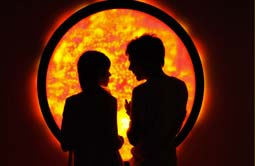

# Compte rendu conference

  

Image d'une oeuvre de l'artiste

source:https://www.lozano-hemmer.com/

## **Compte rendu**

Jade Séguela, registraire et intervenante lors de la conférence du mardi 16 avril 2024, nous a présenté son métier ainsi que le studio Antimodulaire, établi en 2003. Le thème de sa présentation était de nous présenter l'artiste Rafael Lozano Hemmer, artiste mexicain né en 1967, et ses œuvres technologiques, scientifiques et presque toujours interactives.

Jade Séguela s'occupe de plusieurs tâches, des envois à l'international, des emballages des œuvres et de la documentation, etc. L'équipe de gestion de Rafael Lozano Hemmer est composée de R&D, de la production, de la Legacy et de l'exhibition. La présentatrice fait partie de la production et elle a donc présenté certaines des œuvres de l'artiste et les types de défis que des œuvres peuvent causer. De grosses œuvres comme celle de Rafael Lozano Hemmer causent de gros problèmes d'où vient l'importance de la documentation. La documentation aide les équipes, protège le registraire, sert d'archives et au fonctionnement de l'œuvre. L'une des œuvres qui a causé le plus de défis pour l'équipe de l'artiste est l'exposition "Translation Stream". Cette œuvre consiste à traduire les mots français en arabe au milieu d'une île désertique aux Émirats arabes unis. L'un des plus gros problèmes qu'ils ont eu est le délai de 2 semaines pour produire cette exposition. Il y avait aussi le climat, le sable, l'électricité et le manque de transport.

En conclusion, j'ai trouvé que cette présentation était très intrigante car elle révèle des défis que les équipes d'œuvres numériques doivent affronter et elle montre le gros travail derrière des expositions qui nous semblent simples à première vue. Cette conférence nous ouvre les yeux vers un nouvel artiste à découvrir et un nouveau métier à explorer.

