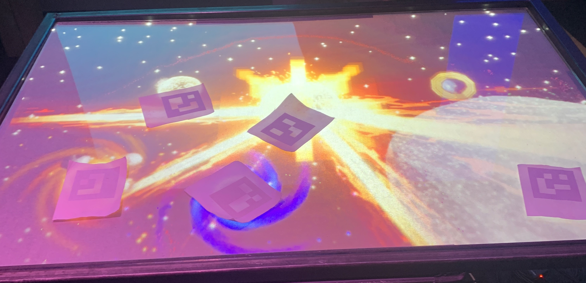
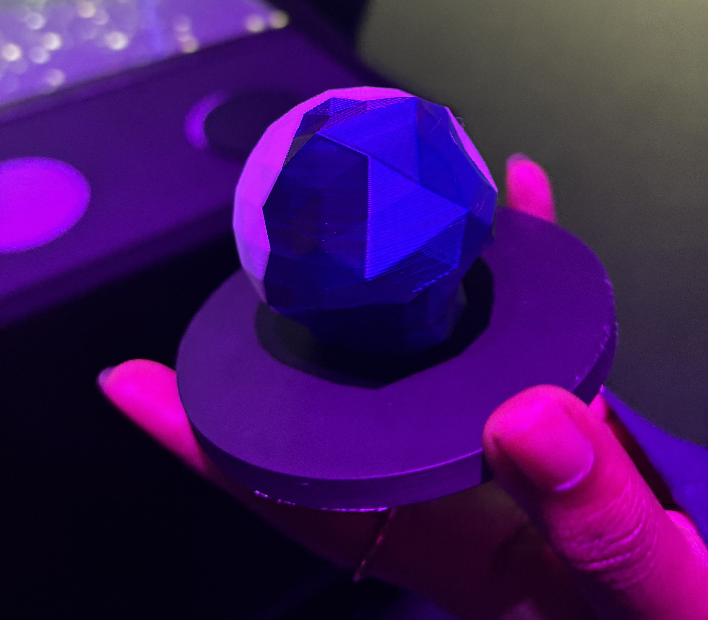
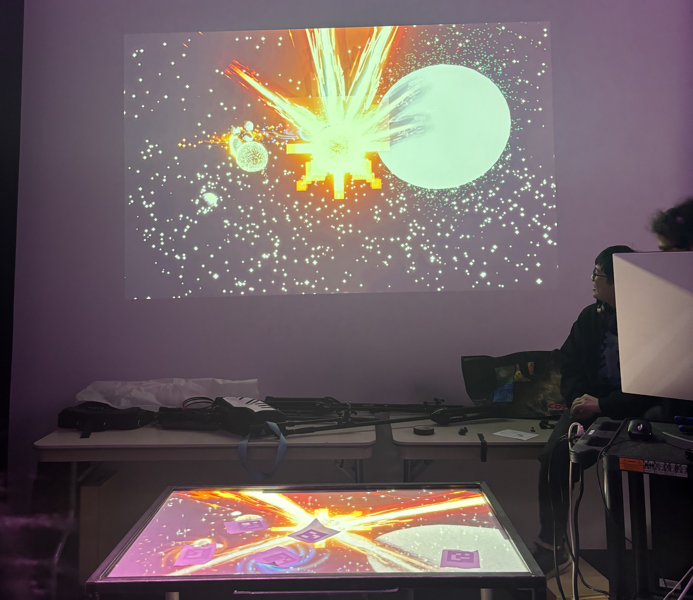
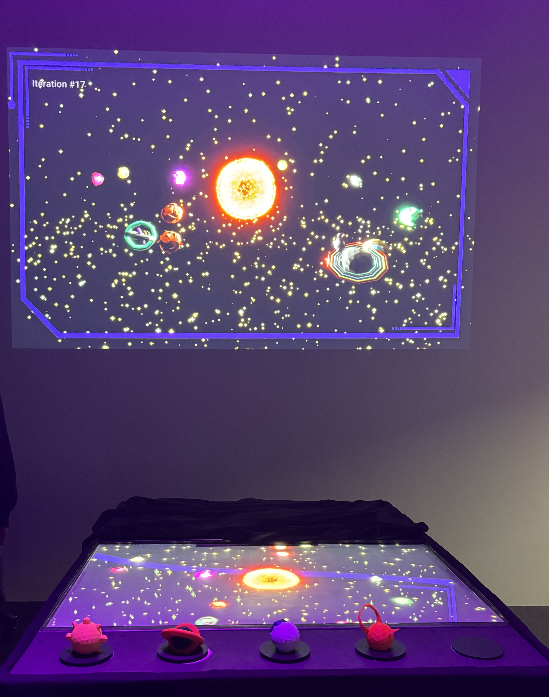

# Canevas Cosmique (2024)

Photo du projet

## **Description**

Canevas Cosmique est une simulation d'un système solaire. C'est une œuvre interactive qui donne le pouvoir à l'utilisateur de déclencher toutes sortes de réactions dans l'espace. Elle se présente sous la forme d'une installation intérieure dans un laboratoire, avec une table et une image projetée sur le mur.

Cette oeuvre est immersive car elle met l'utilisateur a son centre. Sans l'interaction du Participant

## **Noms des réalisateurs**
1.Jacob Alarie-Brousseau

2.Étienne Charron

3.Jérémy Cholette

4.Quoc Huy Do

5.Mikaël Tourangeau

## **Voici une photo de la table interactive**

Photo de la table et des statuts

## **Le matériel requis**

Audio

2 haut-parleurs
4 fils XLR 3 conducteurs de 15' (M->F)
1 carte de son
Vidéo

2 projecteurs vidéo shortrow
3 système d'acrochage
1 caméra infrarouge
Électricité

2 cordon IEC (pour l'alimentation des haut-parleurs)
2 multiprise
Réseau

Switch poe 2 ports
5 Cables Ethernet
2 Cables HDMI
2 Receivers HDMI
2 Sender HDMI
1 Capture card
Ordinateur
1 ordinateur
micro ordinateur

1 raspberry pi

## **Logiciels requis**

1.Touch Designer

2.Unity 2019 lts

3.Autodesk Maya

4.VCV Rack

5.OBS

6.Reaper

7.MadMapper

## **Expérience vécue**

L'interacteur doit se positionner face à la table et utiliser les petites feuilles carrées magnétiques qui font bouger les différents éléments. Sur la table, on retrouve des planètes, un trou noir, le soleil et la lune. Plusieurs réactions sont possibles : on peut juxtaposer des planètes et les fusionner, créer des explosions, etc.

## **Voici une vue d'ensemble du projet non fini**

## **Ce que j'ai aimé**
Je trouve que l'aspect interactif m’a vraiment plu, car une exposition qui engage les visiteurs va toujours être plus pertinente, car on se sent important. Le deuxième aspect que j'ai aime et le thème de l'exposition. L'espace est un thème qui intéresse une grande majorité, ce qui rend cette exposition multimédia évoquant.

## **Ce que j’aurais amélioré**
Ce que j’aurais amélioré serait l’aspect audio.Il n’y avait pas de musique de fond et cela aurait ajouté une meilleure expérience pour les utilisateurs. Rendre les effets sonores plus forts et on mettre plus, car ça ajoute de la dimension a l’expérience.

## **Le projet fini**

Projet terminé
