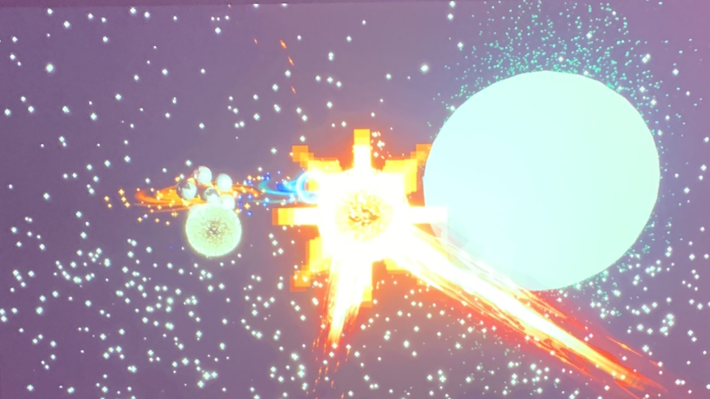

# Canevas Cosmique

Canevas Cosmique est une simulation d'un système solaire. C'est une œuvre interactive qui donne le pouvoir à l'utilisateur de déclencher toutes sortes de réactions dans l'espace. Elle se présente sous la forme d'une installation intérieure dans un laboratoire, avec une table et une image projetée
