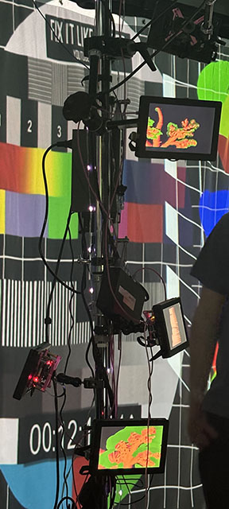

# Effet Papillon (2024)

Photo du projet

# créateurs et créatrices
1.Raphaël Dumont
2.Alexis Bolduc
3.William Morel
4.Alexia (Ryan) Papanikolaou
5.Viktor Zhuravlev
6.Jasmine Lapierre

# Le lien
Crisentia" signifie croissance, et comme dans l'effet papillon, on observe une plante qui prend vie et qui grandit. Le lien entre les deux est assez fort et visible, et il est bien représenté avec cette exposition multimédia.

#l'installation en cours
