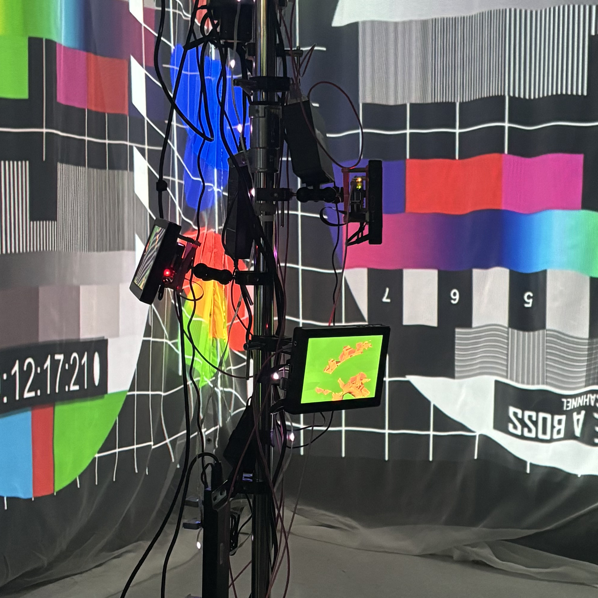
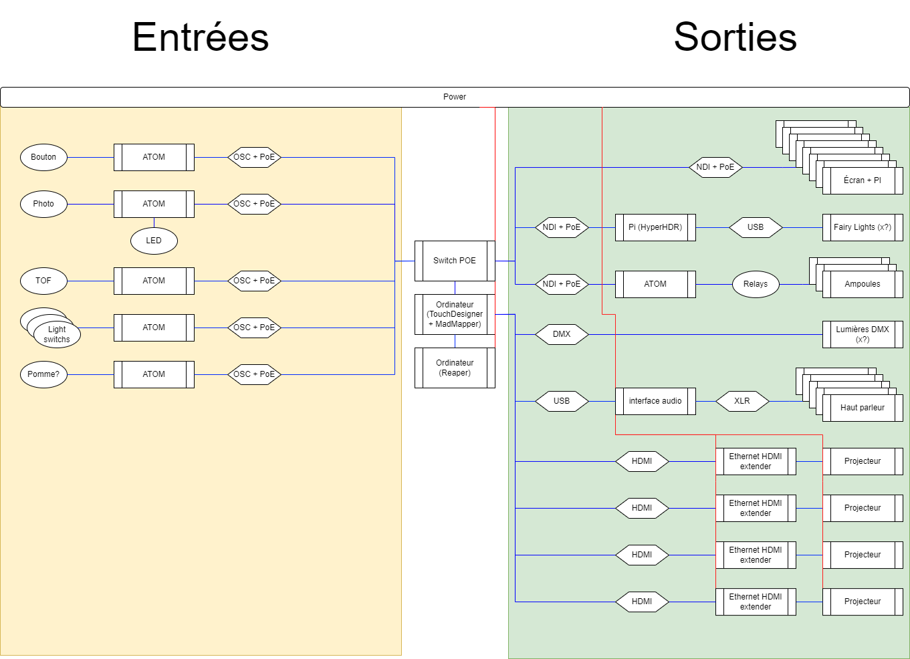
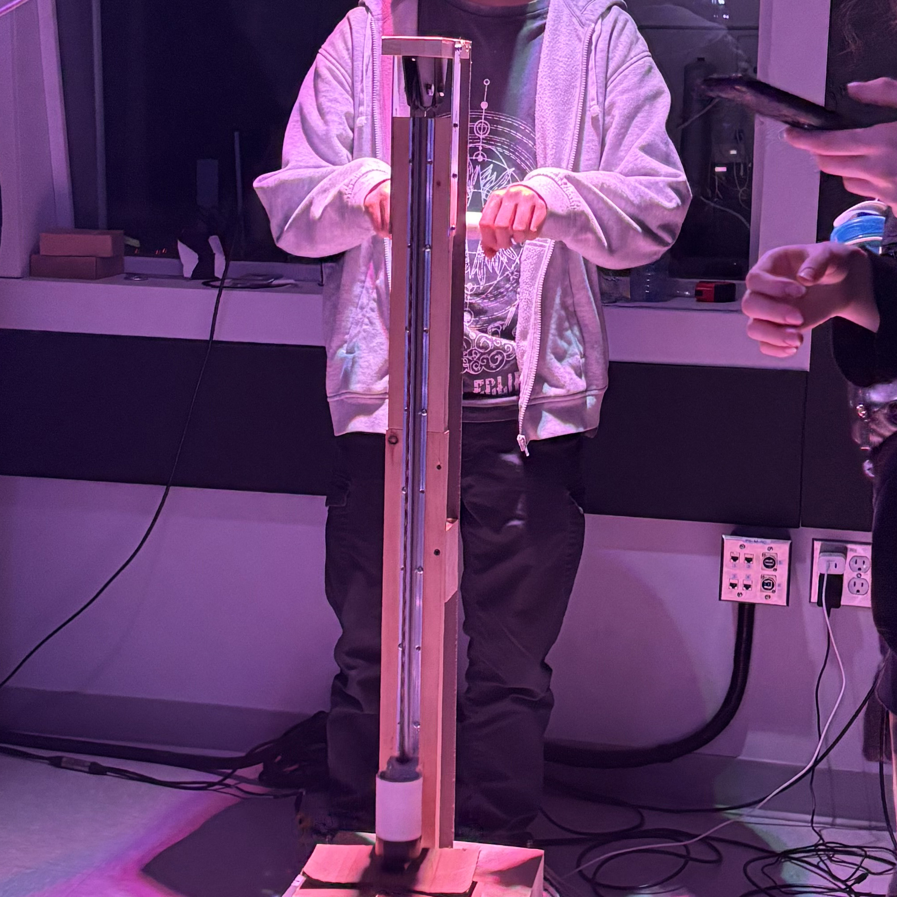

# Effet Papillon (2024)

Photo du projet

# créateurs et créatrices
1.Raphaël Dumont
2.Alexis Bolduc
3.William Morel
4.Alexia (Ryan) Papanikolaou
5.Viktor Zhuravlev
6.Jasmine Lapierre

# Le lien
Crisentia" signifie croissance, et comme dans l'effet papillon, on observe une plante qui prend vie et qui grandit. Le lien entre les deux est assez fort et visible, et il est bien représenté avec cette exposition multimédia.

#l'installation en cours

# le schéma de l'installation prévue

La source: https://tim-montmorency.com/2024/projets/Effet-Papillon/docs/web/preproduction.html

# Mon expérience
 J'ai beaucoup aimé cette installation. J'ai trouvé qu'elle respectait bien le thème de la croissance, et que les effets sonores, lumineux et visuels étaient très bien pensés pour nous immerger dans cette expérience. J'ai aussi apprécié l'aspect interactif qui consistait à donner de l'eau à la plante pour qu'elle grandisse."

 # Cours
Les cours que je pense sont importants pour réaliser cette exposition sont : Audio pour l'aspect sonore de l'expérience, Web pour la programmation et Modélisation 3D pour les objets en 3D."

 # Photos du projets
 l'aspect interactive:

 
 

