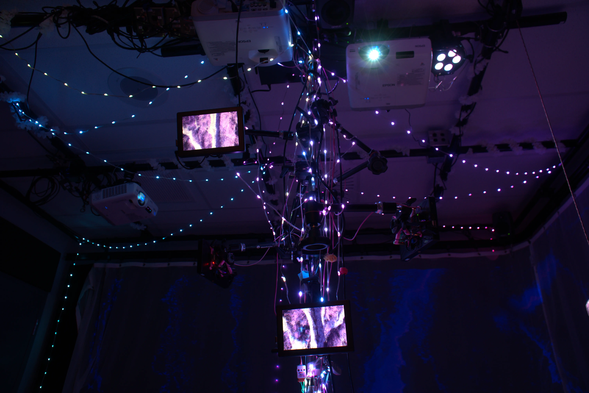

# Effet Papillon (2024)

Photo du projet

# créateurs et créatrices
1.Érick Ouellette
2.Érick Ouellette
3.Gabriel Clerval
4.Nicolas St-Martin
5.Antoine Dion

# Le lien
Le lien entre la croissance et le projet de Kingo est les saisons. Dans cette exposition, on représente les 4 saisons comme des niveaux de difficulté différents. Les saisons représentent donc la vie et, en quelque sorte, la croissance.
#l'installation en cours

# le schéma de l'installation prévue

La source: https://tim-montmorency.com/2024/projets/Effet-Papillon/docs/web/preproduction.html

# Mon expérience
 J'ai beaucoup aimé cette installation. J'ai trouvé qu'elle respectait bien le thème de la croissance, et que les effets sonores, lumineux et visuels étaient très bien pensés pour nous immerger dans cette expérience. J'ai aussi apprécié l'aspect interactif qui consistait à donner de l'eau à la plante pour qu'elle grandisse."

 # Photos du projets
 l'aspect interactive:

 
 

 # SOURCE: https://tim-montmorency.com/2024/projets/Kigo/docs/web/index.html
