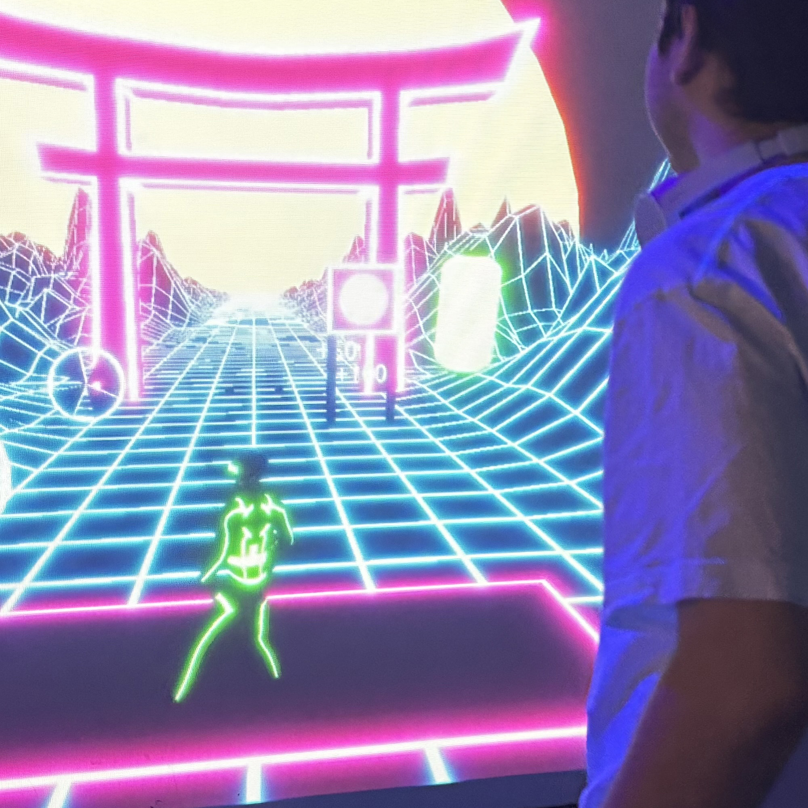
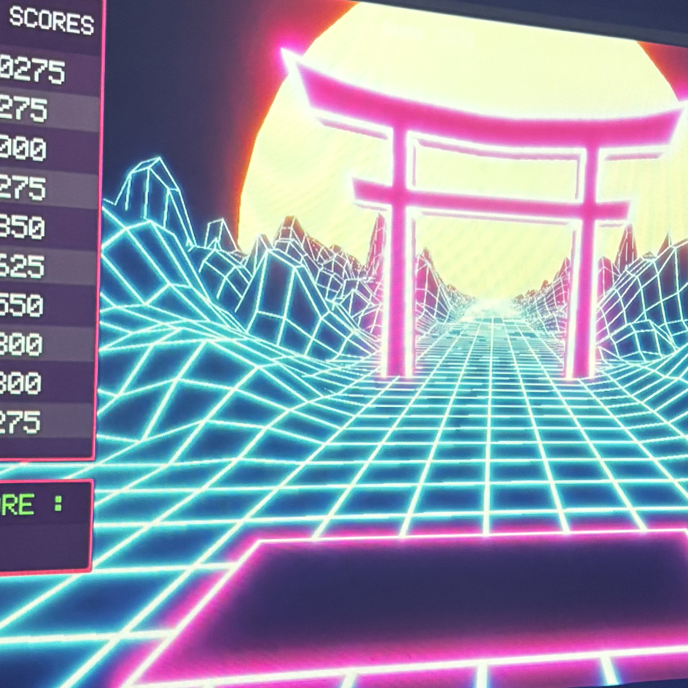

# Kingo (2024)

Photo du projet

# créateurs et créatrices
1.Érick Ouellette
2.Érick Ouellette
3.Gabriel Clerval
4.Nicolas St-Martin
5.Antoine Dion

# Le lien
Le lien entre la croissance et le projet de Kingo est les saisons. Dans cette exposition, on représente les 4 saisons comme des niveaux de difficulté différents. Les saisons représentent donc la vie et, en quelque sorte, la croissance.
#l'installation en cours

# le schéma de l'installation prévue

La source: https://tim-montmorency.com/2024/projets/Kigo/docs/web/preproduction.html

# Mon expérience
 J'ai trouvé que cette exposition était la plus interactive de toutes les expériences. Le thème de la croissance n'est pas si clair, mais on le comprend avec les changements de saisons. Je trouve que le jeu est très amusant et nous incite à bouger, ce qui est bénéfique.

 # SOURCE: https://tim-montmorency.com/2024/projets/Kigo/docs/web/index.html
