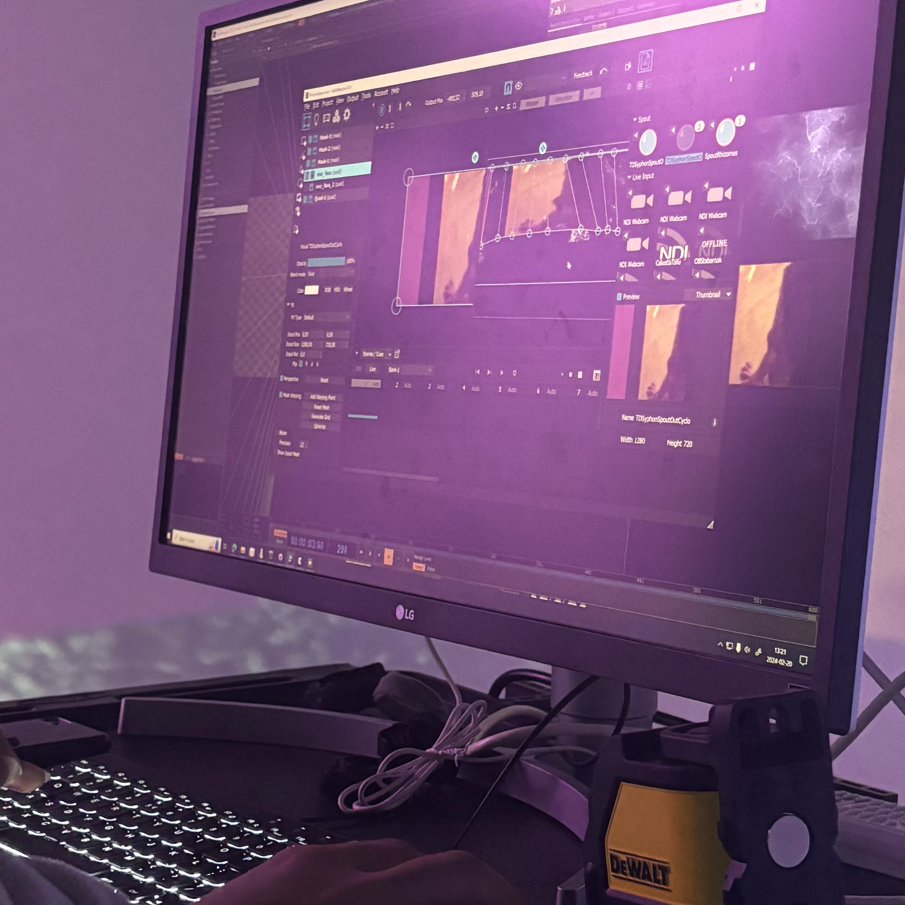

# Rhizomatique (2024)

Photo du projet

# créateurs et créatrices
1.Jolyanne Desjardins
2.MaÏka Désy
3.Laurie Houde
4.Felix Testa Radovanovic

# Le lien
Le lien entre la croissance et Rhizomatique est très présent car on met en avant les souvenirs de l'enfance et le fait que notre cerveau garde ses souvenirs quand on grandit

# l'installation en cours

# le schéma de l'installation prévue

La source: https://tim-montmorency.com/2024/projets/Kigo/docs/web/preproduction.html

# Mon expérience
 J'ai trouvé que cette exposition était la plus interactive de toutes les expériences. Le thème de la croissance n'est pas si clair, mais on le comprend avec les changements de saisons. Je trouve que le jeu est très amusant et nous incite à bouger, ce qui est bénéfique.

 # SOURCE: https://tim-montmorency.com/2024/projets/Kigo/docs/web/index.html

