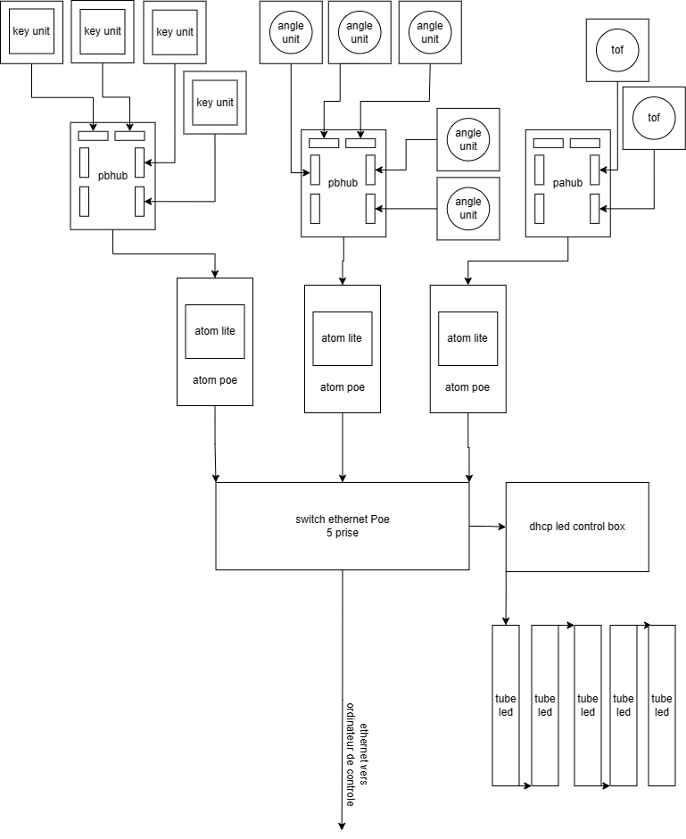
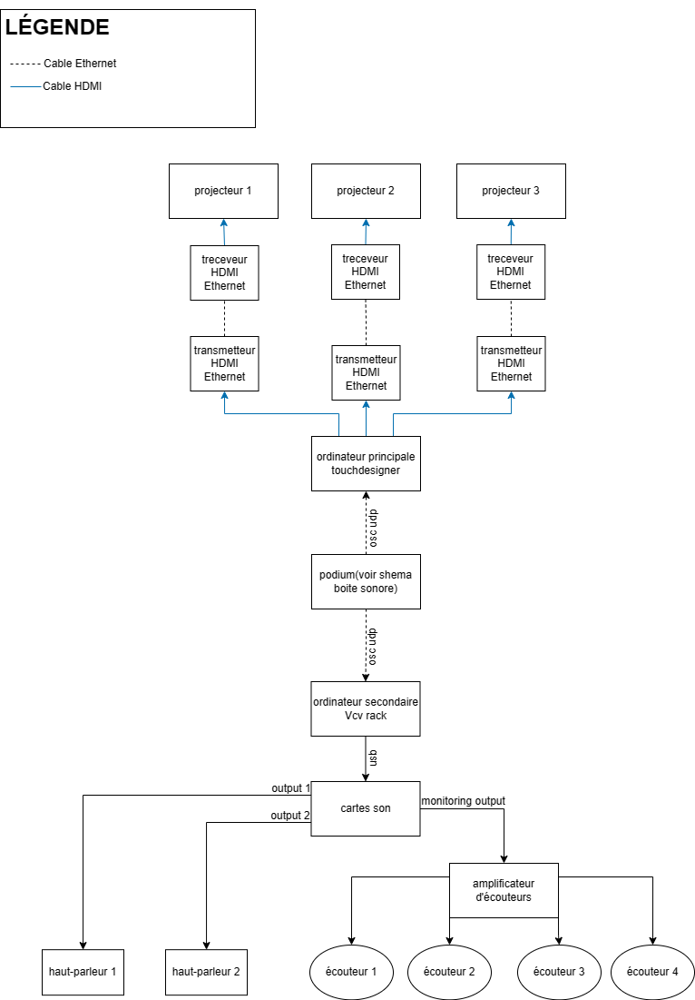

# Sonalux (2024)

Photo du projet

# créateurs et créatrices
1.Antoine Haddad

2.Camélie Laprise

3.Ghita Alaoui

4.Vincent Desjardins

# Le lien
Le lien entre Crescencia et Sonalux se fait par rapport au temps. Le temps est le thème principal de cette exposition qui nous représente la croissance grâce à l'évolution

# l'installation en cours

# le schéma de l'installation prévue

La source: https://tim-montmorency.com/2024/projets/Sonalux/docs/web/preproduction.html

# Mon expérience
Mon expérience avec ce projet était très satisfaisante. J'ai aimé l'aspect visuel et sonore très réfléchi et avancé. J'ai aussi apprécié l'aspect interactif avec les boutons. C'était amusant de découvrir ce que chaque bouton fait.

 # SOURCE: https://tim-montmorency.com/2024/projets/Kigo/docs/web/index.html

