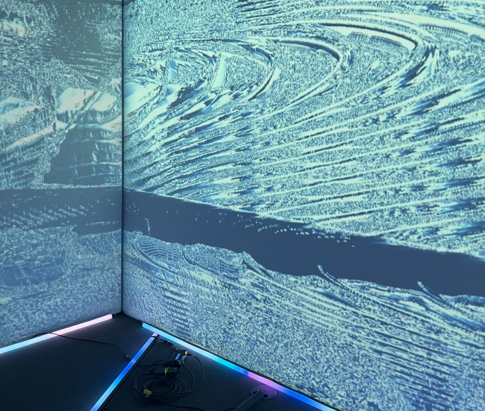
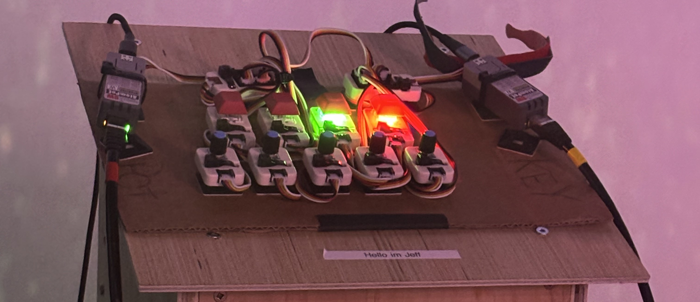

# Sonalux (2024)

Photo du projet

# créateurs et créatrices
1.Antoine Haddad

2.Camélie Laprise

3.Ghita Alaoui

4.Vincent Desjardins

# Le lien
Le lien entre Crescencia et Sonalux se fait par rapport au temps. Le temps est le thème principal de cette exposition qui nous représente la croissance grâce à l'évolution

# l'installation en cours

# le schéma de l'installation prévue

La source: https://tim-montmorency.com/2024/projets/Rhizomatique/docs/web/preproduction.html

# Mon expérience
Mon expérience avec cette exposition était très positive car je peux très bien voir le lien entre Crescencia et ce projet. Il est interactif et nous ramène à l'enfance. J'ai trouvé que le filet qui sert de cerveau est très bien pensé, et le projet est aussi esthétiquement plaisant.

 # SOURCE: https://tim-montmorency.com/2024/projets/Kigo/docs/web/index.html

