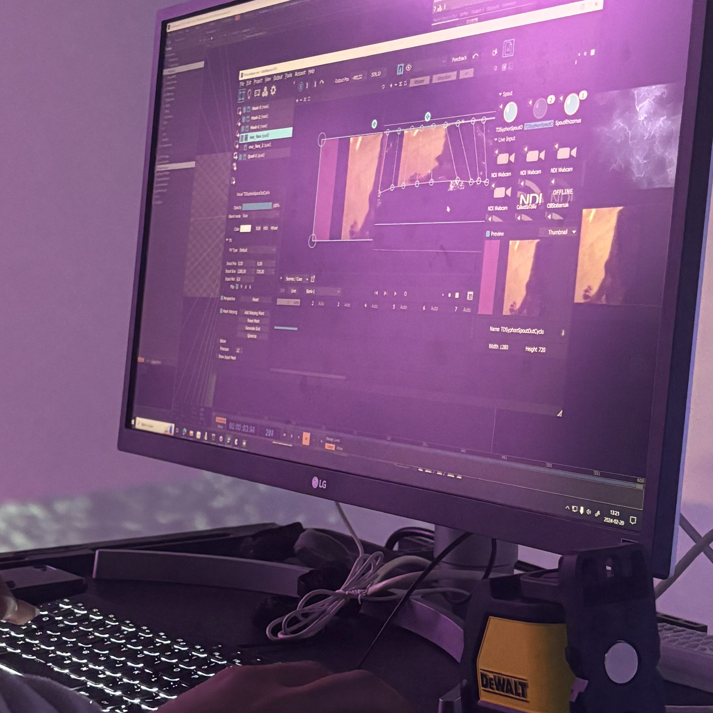

# Sonalux (2024)

.jpeg)
Photo du projet

# créateurs et créatrices
1.Jolyanne Desjardins

2.MaÏka Désy

3.Laurie Houde

4.Felix Testa Radovanovic

# Le lien
Le lien entre la croissance et Rhizomatique est très présent car on met en avant les souvenirs de l'enfance et le fait que notre cerveau garde ses souvenirs quand on grandit

# l'installation en cours

# le schéma de l'installation prévue

La source: https://tim-montmorency.com/2024/projets/Rhizomatique/docs/web/preproduction.html

# Mon expérience
Mon expérience avec cette exposition était très positive car je peux très bien voir le lien entre Crescencia et ce projet. Il est interactif et nous ramène à l'enfance. J'ai trouvé que le filet qui sert de cerveau est très bien pensé, et le projet est aussi esthétiquement plaisant.

 # SOURCE: https://tim-montmorency.com/2024/projets/Kigo/docs/web/index.html

