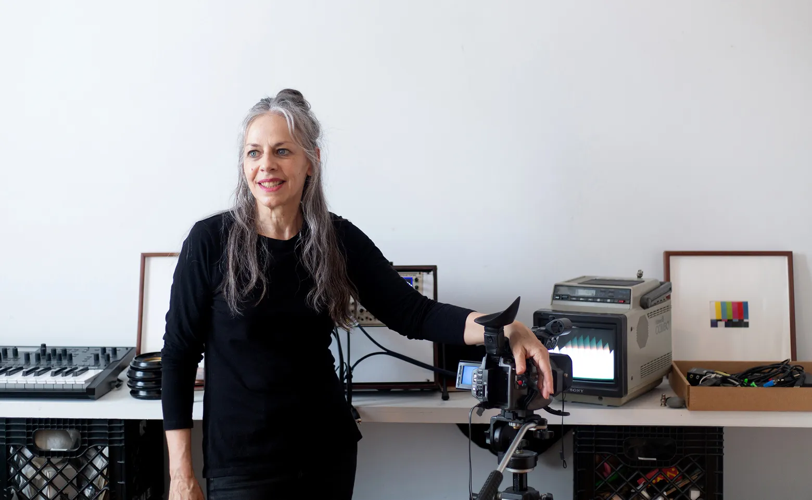

# Pixels, petits points et monument

  

Image de l'oeuvre

## **Type d'exposition**
L'exposition est temporaire et se déroule seulement le soir, entre la tombée du jour et 23h. Elle est en extérieur et il n'y a pas d'interaction possible, on peut seulement la regarder.

 ## **Composantes**
synthétiseur vidéo

Projecteur

## **Lieu de mise en exposition**
11 septembre 2023 – 31 mars 2024

1380, rue Sherbrooke Ouest
Montréal (Québec)

## **Date de la visite**
01/03/2024

## **Année de réalisation**
11 septembre 2023 – 31 mars 2024

## **L'artiste**
Nathalie Bujold est une artiste qui vit ici à Montréal et qui a des œuvres du même type dans plusieurs pays, mais surtout ici au Québec.

Une image de l'artiste

 ## **Description de l'oeuvre**
 Cette œuvre représente des peintures abstraites qui prennent vie et deviennent une vidéo. Ces œuvres attirent l'attention des passants grâce aux motifs de couleurs qui hallucinent les spectateurs. L'artiste décrit son œuvre comme une sorte de « tissage vidéographique ». « C’est dans les relations ténues entre le réel et l’abstraction, la lenteur du labeur et l’instantanéité du numérique, la profondeur et la surface que se jouent les rencontres. »
source:https://www.mbam.qc.ca/fr/expositions/nathalie-bujold/

