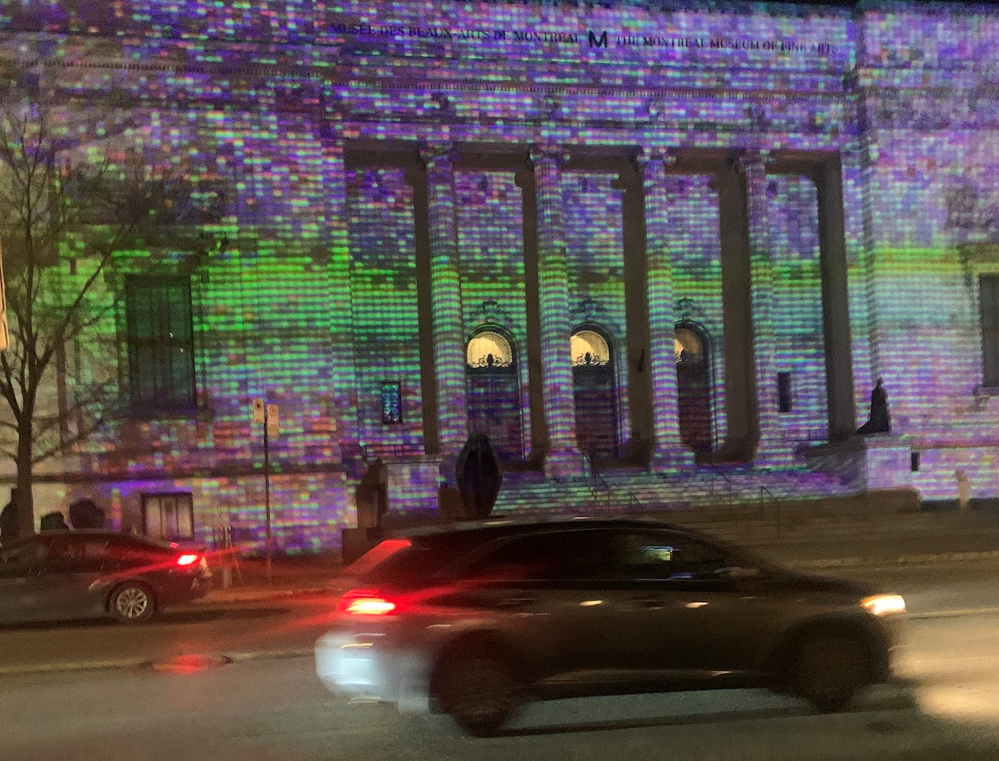

# Pixels, petits points et monument

  

Image de l'oeuvre

## **Type d'exposition**
L'exposition est temporaire et se déroule seulement le soir, entre la tombée du jour et 23h. Elle est en extérieur et il n'y a pas d'interaction possible, on peut seulement la regarder.
## **Lieu de mise en exposition**
11 septembre 2023 – 31 mars 2024

1380, rue Sherbrooke Ouest
Montréal (Québec)

## **Date de la visite**
01/03/2024

## **L'artiste**
Nathalie Bujold est une artiste qui vit ici à Montréal et qui a des œuvres du même type dans plusieurs pays, mais surtout ici au Québec.
