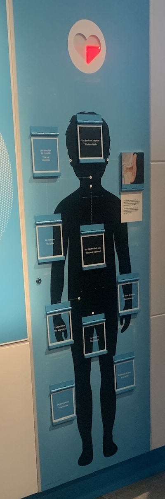
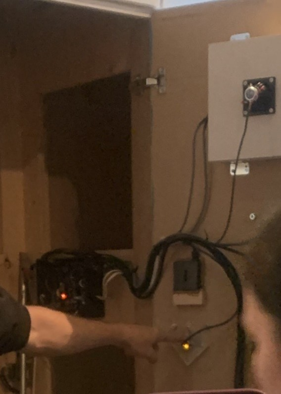

# Visite centre des sciences
## **Coeur qui s'allume (2017)**

## **Lieu et date de visite**
Centre des sciences 

2 rue de la Commune Ouest, Montréal

Le 5 avril

## **Description du dispositif**

Le but de ce dispositif est d'interagir avec et de trouver les bonnes réponses aux questions scientifiques posées. Le cœur s'allume en fonction du nombre de réponses trouvées et lorsque le cœur s'allume complètement, cela signifie que nous avons trouvé toutes les réponses.

## **Composantes et techniques**
Les composantes techniques utilisées pour ce dispositif sont : des électro-aimants, des capteurs, des haut-parleurs, une boîte lumineuse et bien sûr de la programmation.

## **Type de dispositif**

Ce dispositif est permanent et est renouvelé tous les 10 ans, donc en 2027 pour le prochain renouvellement. La plupart des expositions fonctionnent environ 80 % du temps car les technologies ne durent au maximum que 4 ans, ce qui peut poser des défis aux équipes de production. Le budget est un gros problème car les nouvelles technologies coûtent très cher, donc il faut trouver des solutions astucieuses et à bas coût pour régler les problèmes techniques des dispositifs.

## **Logiciels**
1. raspberry

2. arduino

 ## **❤️ Ce qui m'a plu**
Ce que j'ai aimé dans ce dispositif en particulier est sa simplicité du point de vue interactif mais aussi technique. Il n'y a pas tant de composantes techniques utilisées car l'équipe de production des centres des sciences veut garder un budget minimal, ce qui leur permet d'être créatif lorsqu'ils doivent faire fonctionner leur dispositif et trouver des solutions à leurs problèmes. J'ai aussi beaucoup aimé le fait que le cœur s'allume lorsqu'on trouve les bonnes réponses car cela récompense l'utilisateur, ce qui le rend heureux.

## **Les credits**

